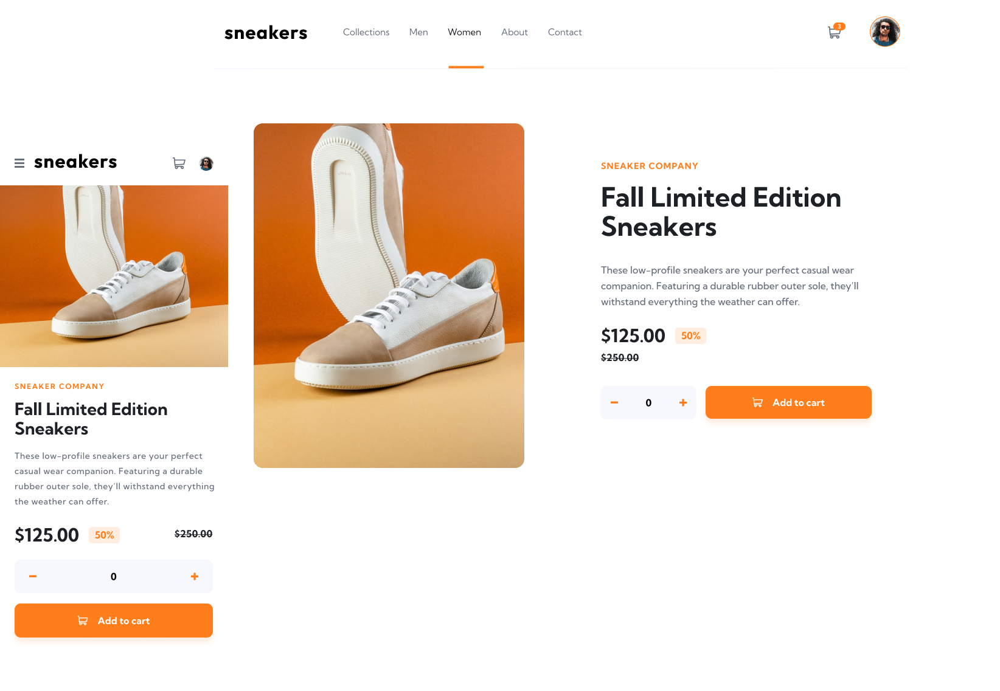

<h1 align="center">
   
   
 ShopShoes E-commerce - Em Construção  

</h1>
 

  

 
 

 <a href="#tecnologias">Tecnologias</a> •
 <a href="#layout">Layout</a> • 
 <a href="#guia-de-estilo">Guia de estilo</a> • 
 <a href="#tecnologias">Tecnologias</a> • 
 <a href="#autora">Autora</a>

## Sobre
Este é um projeto de e-commerce de tênis utilizando React , Tailwind e Stripe. O objetivo deste projeto é criar uma plataforma online para vender tênis de diferentes modelos, com funcionalidades como  carrinho e  pagamento..

## Funcionalidades

## Tecnologias

## Guia de estilo

### Cores:

### Tipo de Fonte:

## Autora

<a href="https://www.linkedin.com/in/tayanna-amorim-98161623b/">
 
  
 <b>Tayanna Amorim</b></a> 
  
 

